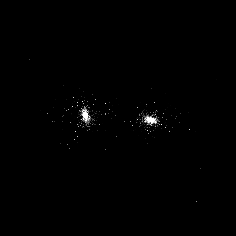

# particle-sim

Simulation of particles affected by gravity in C++/CUDA on Windows.



## Install

1. Install Visual Studio or VS Code

2. Install MinGW
    * Download and install MinGW from https://sourceforge.net/projects/mingw/
    * Run the MinGW Installation Manager and select:
      * mingw32-base
      * mingw-gcc-g++
      * mingw32-pthreads-w32 dev/doc/lic
    * Select Installation -> Apply Changes -> Apply
    * Add `C:\MinGW\bin` to the system environment variables Path

3. Install `make`
    * Install Chocolatey from https://chocolatey.org/install
    * Run `choco install make` in an elevated shell

## Compile

```
make all
```

## Run

```
.\Program.exe
```
