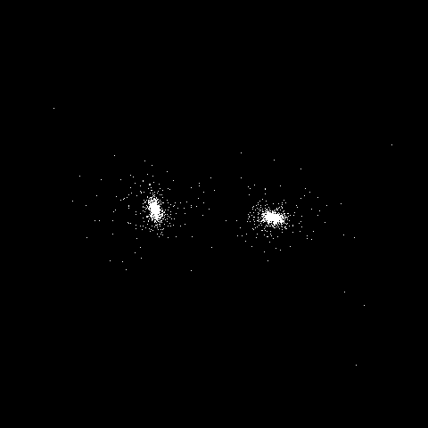

# particle-sim

Simulation of particles affected by gravity in C++/CUDA. Requires NVIDIA GPU for the CUDA stuff. See table below for CPU/GPU support.

| Support                | CPU | GPU |
| ---------------------- | --- | --- |
| Windows (native)       | ✅  | ❌  |
| Windows (WSL + docker) | ✅  | ✅  |
| Ubuntu (docker)        | ✅  | ✅  |



## 1. Install

Here are some different alternatives for installation:
- 1.1 Windows (native)
- 1.2 Windows (WSL + docker)
- 1.3 Ubuntu (docker)

Before you start:
- [Install the latest GPU drivers](https://www.nvidia.com/en-us/drivers/)
- [Install VS Code](https://code.visualstudio.com/download) (optional)

### 1.1 Windows (native)

1. Install MinGW
    - Download and install MinGW from https://sourceforge.net/projects/mingw/
    - Run the MinGW Installation Manager and select:
      - mingw32-base
      - mingw-gcc-g++
      - mingw32-pthreads-w32 dev/doc/lic
    - Select Installation -> Apply Changes -> Apply
    - Add `C:\MinGW\bin` to the system environment variables Path
2. Install `make`
    - Install Chocolatey from https://chocolatey.org/install
    - Run `choco install make` in an elevated shell
3. [Install CUDA](https://developer.nvidia.com/cuda-downloads)

### 1.2 Windows (WSL + docker)

1. [Install WSL 2](https://learn.microsoft.com/en-us/windows/wsl/install)
    - Open powershell with admin priviliges
    - Run `wsl --install`
    - Restart the system
    - Might be necessary:
      - Check distros: `wsl --list --online`
      - Install: `wsl --install Ubuntu`
    - To launch WSL:
      - Type `wsl` or `wsl -d Ubuntu` in powershell, or
      - Windows key -> type `wsl` -> Enter
    - [Set up dev environment](https://learn.microsoft.com/en-us/windows/wsl/setup/environment)
      - Run `wsl`
      - Set Linux username and password
      - `sudo apt update && sudo apt upgrade`
2. [Set up VS Code with WSL](https://learn.microsoft.com/en-us/windows/wsl/tutorials/wsl-vscode) (optional)
    - Install the Remote Development extension pack
    - Might be necessary to run in WSL:
      - `sudo apt update`
      - `sudo apt install wget ca-certificates`
3. Continue with the following Ubuntu instructions from inside WSL

### 1.3 Ubuntu (docker)

1. [Install docker](https://docs.docker.com/engine/install/ubuntu/)

```bash
# Add Docker's official GPG key:
sudo apt update
sudo apt install ca-certificates curl
sudo install -m 0755 -d /etc/apt/keyrings
sudo curl -fsSL https://download.docker.com/linux/ubuntu/gpg -o /etc/apt/keyrings/docker.asc
sudo chmod a+r /etc/apt/keyrings/docker.asc

# Add the repository to Apt sources (all this is a single command):
sudo tee /etc/apt/sources.list.d/docker.sources <<EOF
Types: deb
URIs: https://download.docker.com/linux/ubuntu
Suites: $(. /etc/os-release && echo "${UBUNTU_CODENAME:-$VERSION_CODENAME}")
Components: stable
Signed-By: /etc/apt/keyrings/docker.asc
EOF

# Update packages
sudo apt update

# Install the latest version of docker
sudo apt install docker-ce docker-ce-cli containerd.io docker-buildx-plugin docker-compose-plugin

# Verify that docker is running
sudo systemctl status docker
# If not, run: sudo systemctl start docker

# Verify the installation by running the hello-world image
sudo docker run hello-world

# Check if the docker group exists
compgen -g
# If not, run: sudo groupadd docker
# Add your user to the group
sudo usermod -aG docker $USER
# Might need to restart terminal/machine
reboot
```

2. [Install the NVIDIA Container Toolkit](https://docs.nvidia.com/datacenter/cloud-native/container-toolkit/latest/install-guide.html)

```bash
# Install prerequisites
sudo apt update && sudo apt install -y --no-install-recommends \
   curl \
   gnupg2

# Configure the production repository
curl -fsSL https://nvidia.github.io/libnvidia-container/gpgkey | sudo gpg --dearmor -o /usr/share/keyrings/nvidia-container-toolkit-keyring.gpg \
    && curl -s -L https://nvidia.github.io/libnvidia-container/stable/deb/nvidia-container-toolkit.list | \
    sed 's#deb https://#deb [signed-by=/usr/share/keyrings/nvidia-container-toolkit-keyring.gpg] https://#g' | \
    sudo tee /etc/apt/sources.list.d/nvidia-container-toolkit.list

# Update packages
sudo apt update

# Install the NVIDIA Container Toolkit packages
export NVIDIA_CONTAINER_TOOLKIT_VERSION=1.18.1-1
sudo apt-get install -y \
    nvidia-container-toolkit=${NVIDIA_CONTAINER_TOOLKIT_VERSION} \
    nvidia-container-toolkit-base=${NVIDIA_CONTAINER_TOOLKIT_VERSION} \
    libnvidia-container-tools=${NVIDIA_CONTAINER_TOOLKIT_VERSION} \
    libnvidia-container1=${NVIDIA_CONTAINER_TOOLKIT_VERSION}

# Configure the container runtime
sudo nvidia-ctk runtime configure --runtime=docker
sudo systemctl restart docker

# Verify that everything is installed correctly (you should see driver/CUDA versions and more):
sudo docker run --rm --runtime=nvidia --gpus all ubuntu nvidia-smi

# Allow connection to X server (might be necessary)
sudo apt install x11-xserver-utils
xhost +local:docker
```

## Run

Native Windows:
- Compile: `make [cpu|gpu]`
- Run: `.\ParticleSim.exe`

WSL/Ubuntu:
- Build and start container: `docker compose up`
- Launch shell: `docker compose exec particles bash`
- Compile: `make [cpu|gpu]`
- Run: `./ParticleSim`
- Profiling (GPU):
  - Profile: `nsys profile -t cuda --stats=true ./ParticleSim`
  - View report: `nsys-ui report1.nsys-rep`
